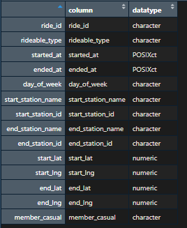
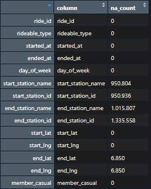
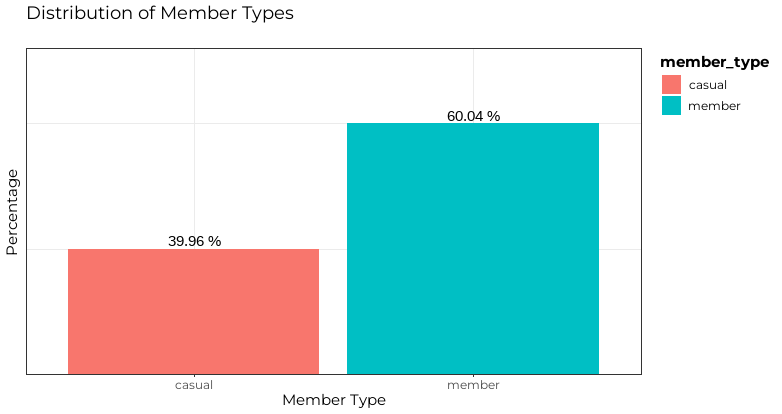
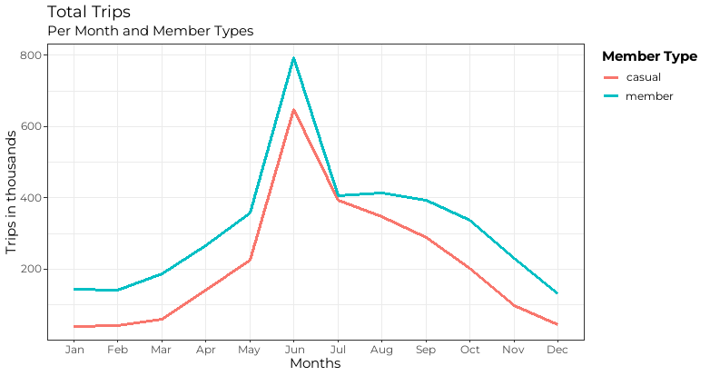
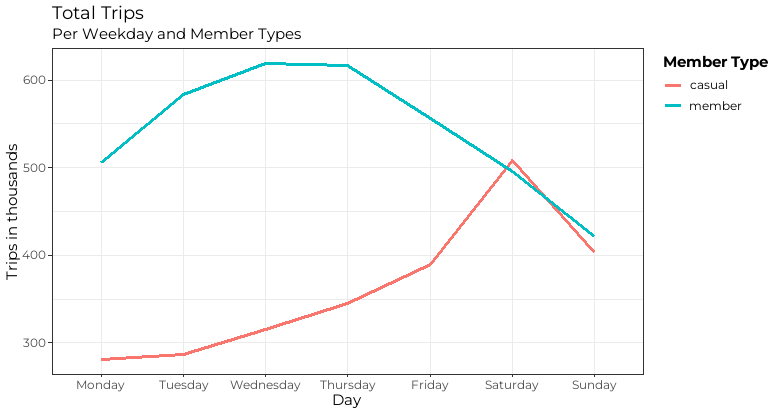
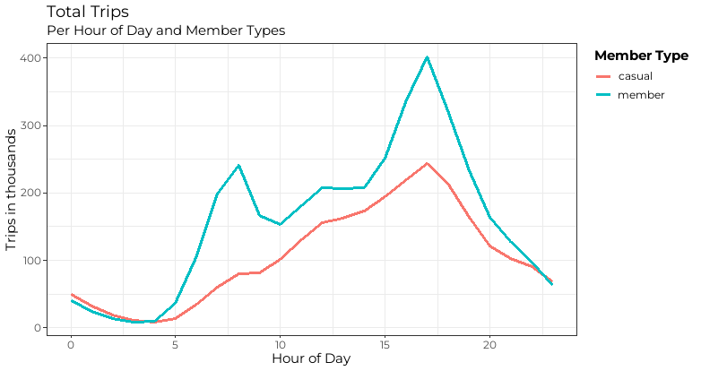
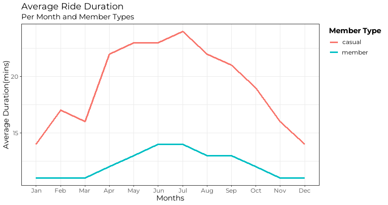
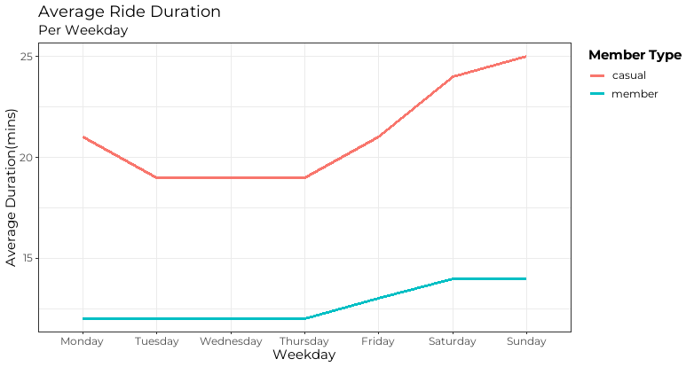
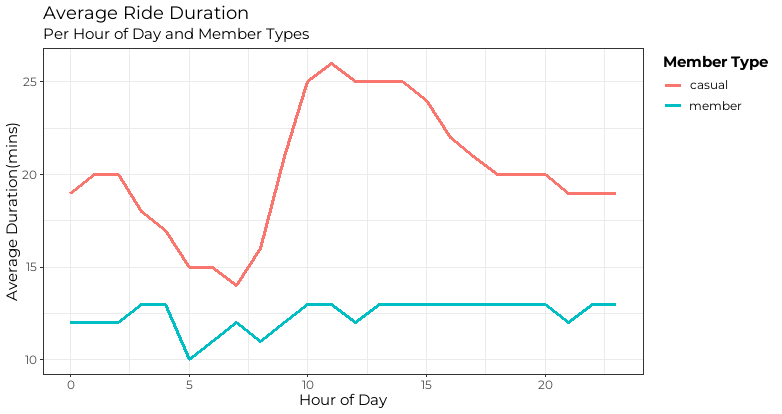

# Google Data Analytics Capstone: Cyclistic Case Study
On this Repository, i will perform the [Google Data Analytics Capstone Project](https://www.coursera.org/learn/google-data-analytics-capstone) (a case study from the Google Data Analytics course).

## Introduction
In this case study, i will perform tasks of a junior data analyst for a fictional company named Cyclistic.

## Summary (links)
Data Source: [here](https://divvy-tripdata.s3.amazonaws.com/index.html)

Code:

## Cyclistic
Cyclistic is a bike-sharing company, which features more that 5800 bikes in 600 different stations across Chicago.
The bikes can be unlocked from one station and returned to any other station in the system anytime.
Something innovative about this company, is the offer of reclining bikes, hand tricycles and cargo bikes, making bike-share more
inclusive to people with disabilities. The majority of riders opt for traditional bikes; about 8% of riders use the assistive options. 
Cyclistic users are more likely to ride for leisure, but about 30% use them to commute to work each day.

Until now, Cyclistic’s marketing strategy relied on building general awareness and appealing to broad consumer segments.
One approach that helped make these things possible was the flexibility of its pricing plans: single-ride passes, full-day passes,
and annual memberships. Customers who purchase single-ride or full-day passes are referred to as casual riders. Customers
who purchase annual memberships are Cyclistic members.

Cyclistic’s finance analysts have concluded that annual members are much more profitable than casual riders. Although the
pricing flexibility helps Cyclistic attract more customers, they believe that maximizing the number of annual members will
be key to future growth. Rather than creating a marketing campaign that targets all-new customers, Moreno believes there is a
very good chance to convert casual riders into members. She notes that casual riders are already aware of the Cyclistic
program and have chosen Cyclistic for their mobility needs.

So the goal is clear: Design marketing strategies aimed at converting casual riders into annual members.

## Task and Scenario
So working as a junior data analyst for the marketing analytics team, my task is to understand how casual riders and annual members
use Cyclistic bikes differently. After evaluating the data, the team will make recommendations on how to convert casual riders into annual members.

## Data Source
I will use Cyclistic’s historical trip data to analyze and identify trends from jun 2022 to june 2023. So there is a csv file for every month in this period. The data can be downloaded [here](https://divvy-tripdata.s3.amazonaws.com/index.html)

This is public data that can be used to explore how different customer types are using Cyclistic bikes. But note that data-privacy issues prohibit from using riders’ personally identifiable information. This means that we won’t be able to connect pass purchases to credit card numbers to determine if casual riders live in the Cyclistic service area or if they have purchased multiple single passes.

## Description of Data
There are 12 files with naming convention of "YYYYMM-divvy-tripdata". As i mentioned before, each file includes information for one month.
These are the following columns which are alway the same for each file: ride_id, rideable_type, started_at, ended_at, start_station_name, start_station_id, end_station_name, end_station_id, start_lat, start_lng, end_lat,end_lng and member_casual

# Process

NOTE: It was not possible to import the whole combined data into excel because it was too big. So in excel before the exploration process, i added the column "day_of_week" in each of the 12 files.
This column will be important later for my analysis

## Data Exploration
Before cleaning the data, i am checking out the data to see if i find any inconsistencies. For the Data exploration Process i used R.
Code is available [here!](code/data_exploration.R)

### Observations

- The table shows the datatype of all columns of the dataframe.
  

- Number of NA Values per column
  

- There are no duplicate rows in the data.
- Two unique values in the member_casual column. The only possible values for this column are "casual" and "member"
- Columns of stations names and coordinates will be removed because they wont be relevant for the analysis.

## Data Cleaning and Data Manipulation
Code of the cleaning and manipulation process is [here!](code/data_cleaning_manipulation.R)   

### Process
1. Removed following columns which are nor relevant for analysis: start_station_name, start_station_id, end_station_name, end_station_id, start_lat, start_lng, end_lat, end_lng
2. Renamed member_casual column to member_type which seemed more appropiate
3. Added column ride_duration and ride_duration_mins which is the time difference between ended_at and started_at
4. Filtered unplausible ride durations(everything longer than a day and less than a minute)
5. Removed 220.218 rows

## Data Analysis
Code of the analyzing process is [here!](code/data_analysis.R)

Analyzing question: How do annual members and casual riders use Cyclistic bikes differently?

So to answer this question, i compared member and casual riders by the number of trips they did in a certain period of time aswell as their average ride duration.

First of all, i wanted to know the percentages of the casual riders and members 

As you can see, the members make 60% of the total while the casual riders constitute 40%.

Then, the total amount of trips by months, day of week and hour of the day.

### Trips by Month
Seeing the amount of trips by month, we can see that both casual riders and members show very similar behavior throughout the months, having more trips in the summer months.
Overall the members have made more trips than the casual riders in every month being the closest gap in july.

### Trips by Days of Week
Comparing the days of week, it can be seen that again the members make more trips than the casual riders being saturday the exception where casual riders made slightly more trips than members.
Also it is interesting to see, that the members show a decline over the week in contrast to the casual riders which experience a rise over the week having their peak on the weekends.

### Trips y Hours of Day
The amount of trips for the casual riders increase consistenly over the day until about 5 PM. Then it starts to decrease.
On the member's side, two peaks can be seen throughout the day. One is early around 8 AM and other around 5 PM.

From the amount of total rides made, we can infer that members tend to use the service for commuting to and from their workplace during the week while 
the casual riders use the service more freuquently over the weekends which could be for leisure purposes.

Now, the average ride durations by months, day of week and hour of the day.

In all comparisons it can be seen that casual riders usually cycle longer than members on average. 
The avergae duration of members don't really change considerably throughout the month, week or hour of day.
On the other side there a bigger variations in how long casual riders cycle depending on the month, day of week or time of day.
They make longer journeys on the spring and summer months, on the weekends and from 10 AM to 3 PM during the daywhich indicates that they
might be doing it for recreation purposes.

### Summary

**Casual**
- Travel around two to three times longer than members but with less frequncy.
- Use bikes more freuquent throughout the day, over the weekends in summer and spring for leisure.

**Member**
- Prefer riging on weekdays during commute hours especially in summer and spring
- Travel with more frequency but rides are shorter

## Recomendations
After sharing the insights of the different riding behavior between member and casual riders, my recommendations to target casual riders
would be the following:

1. Introducing memberships which are more appealing to casual riders for the summer months.
2. Offer seasonal or weekend-only memeberships.
3. In the membership also offer discounts for longer rides.

**NOTE**
More data is needed to know how many of the casual riders are local residents or just visitors/tourists.
